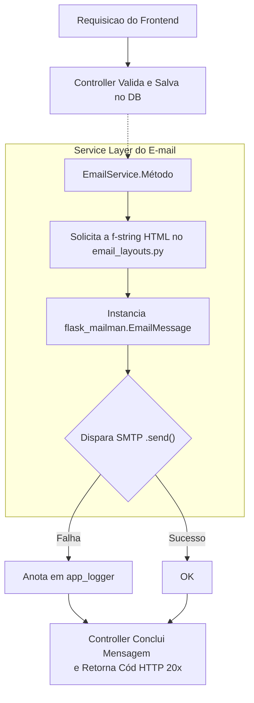

# Documentação: Funcionalidade de Envio de E-mails - Barba & Byte

A funcionalidade de e-mails tem como objetivo notificar os clientes do sistema em ações importantes, garantindo um bom fluxo de comunicação do negócio (como confirmações de serviço na barbearia e novas contas cadastradas).

Esta documentação fornece uma visão clara das tecnologias e regras de negócio utilizadas para implementar a automação de e-mails no backend Flask da aplicação.

> [!NOTE]
> Esta camada de envio foi arquitetada para ser fracamente acoplada (loose coupling), e possui falhas perdoáveis. Caso a rede com o servidor de envio de e-mail (SMTP) caia temporariamente, a aplicação irá seguir criando o e.g. "Agendamento" normalmente, apenas apontando internamente o erro pelo log para os desenvolvedores.

---

## 1. Tecnologias Utilizadas

* **Flask-Mailman**: Uma extensão que encapsula o gerenciamento moderno e o envio de e-mails em um app Flask, sendo um "fork" seguro derivado do módulo de e-mail sólido do Django.
* **Componentes Nativos Python**: Utilização de `os` e do `python-dotenv` para prover segredo nas credenciais em um arquivo não-versionado `.env`, garantindo que endereços, portas e TLS fiquem invisíveis em ambientes em nuvem.

## 2. Arquitetura e Estrutura de Diretórios 

A implementação está orientada principalmente à **Camada de Serviços (Service Layer)** para promover um código mais limpo nas Rotas:

1. **`app/services/email_service.py`**:
   * Abriga a classe genérica `EmailService`.
   * Contém apenas **métodos estáticos** (como `enviar_notificacao_simples` ou `enviar_email_boas_vindas`), facilitando a chamada sem necessidade de injetar dependências massivas pelo projeto.
   * Conta com blocos `try/except` com uma chamada ao Logger de Erros (`app_logger`) onde expõe os reais problemas ao log sem travar a requisição do usuário.
2. **`app/utils/email_layouts.py`**:
   * Atuando como uma camada puramente Visual (View), este arquivo abriga variáveis de *Layouts* em HTML puro (Strings Estilizadas com CSS Inline estático, o padrão mais comum em clientes de e-mail).
   * Contém funções como `obter_layout_agendamento(nome, data...)` que retornam f-strings populadas da árvore das propriedades desejadas.
3. **`config.py` e `__init__.py`**: 
   * Todo o carregamento do `MAIL_SERVER` ou `MAIL_USERNAME` acontece primeiramente no objeto `Config()`, tornando limpa a inicialização da Extensão `mail.init_app(app)` no construtor visual.

---

## 3. Fluxo de Execução (Diagrama / Passo a Passo)



### 3.1. Caso de Uso: Boas-vindas (Cadastro de Cliente)
1. **Endpoint Acionado**: O usuário acessa a rota POST `/api/clientes` para criar um novo usuário.
2. **Ativação**: Imediatamente após a chamada `db.session.commit()`, o recurso ativa `EmailService.enviar_email_boas_vindas()`.
3. **Desfecho**: Um layout customizado é moldado com o "Nome" da pessoa a partir do `.title()` e a pessoa recebe a caixa de confirmação.

### 3.2 Caso de Uso: Agendamentos (Criação e Edição)
1. **Endpoint Acionado**: O usuário acessa a rota POST `/api/agendamento` ou o PATCH `/api/agendamento/<id>`.
2. **Dados Relacionais**: As rotas consultam não apenas o objeto isolado do agendamento, mas instanciam fisicamente o `Cliente`, `Serviço` e o `Barbeiro` responsável (`Cliente.query.get(agendamento.cliente_id)`) para injetar seus "nomes" humanamente legíveis no layout do E-mail.
3. **Disparo**: O Controller gera o envio de e-mail formatado via:
   `EmailService.enviar_notificacao_simples(cliente.email, "Agendamento Criado", HTML_da_mensagem)`.
4. **Resiliência do Controller**: O Controller valida fisicamente o retorno `bool` do Serviço de E-mail. 
   - Se o E-mail não alcançar seu destino, ele devolve no JSON a mensagem *"Agendamento atualizado, mas e-mail não enviado"* com `status="sucesso"`.
   - Isso garante uma boa e amigável experiência do usuário caso haja intermitências com provedores de SMTP alheios ao contexto lógico da aplicação atual.

## Variáveis de Ambiente Requeríveis no `.env`

Certifique-se de configurar a raiz do seu servidor corretamente utilizando os seguintes parâmetros:
```env
# E-mails (Exemplo usando Gmail SMTP)
MAIL_SERVER=smtp.gmail.com
MAIL_PORT=587 
MAIL_USE_TLS=True
MAIL_USERNAME=minha-barbearia-suporte@gmail.com
MAIL_PASSWORD=uma_senha_de_autenticacao_google_apps_muito_segura
MAIL_DEFAULT_SENDER=minha-barbearia-suporte@gmail.com
```
